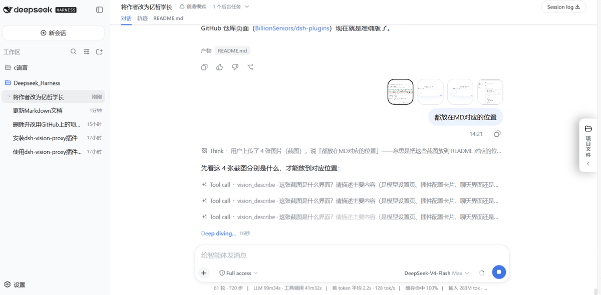
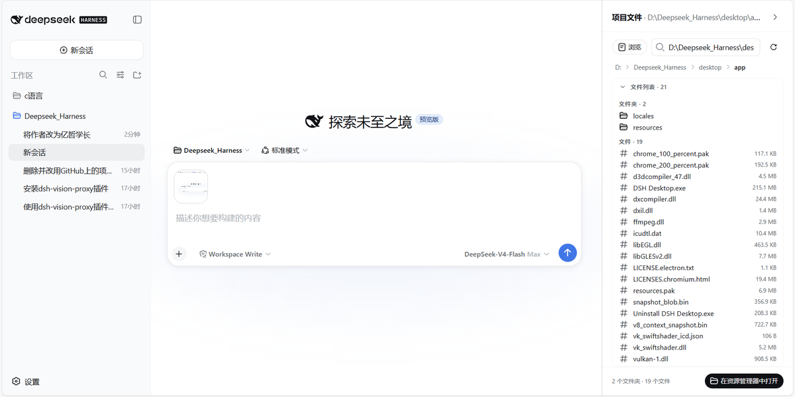
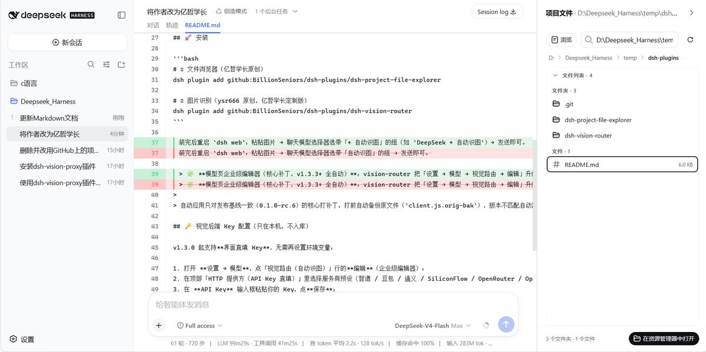
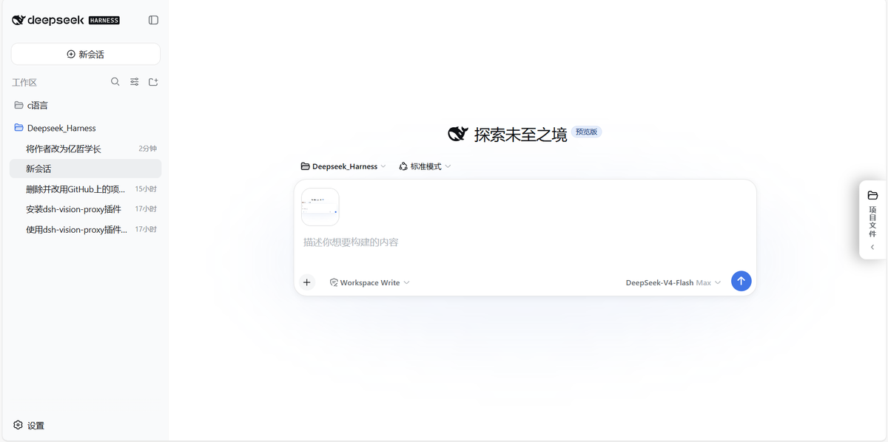
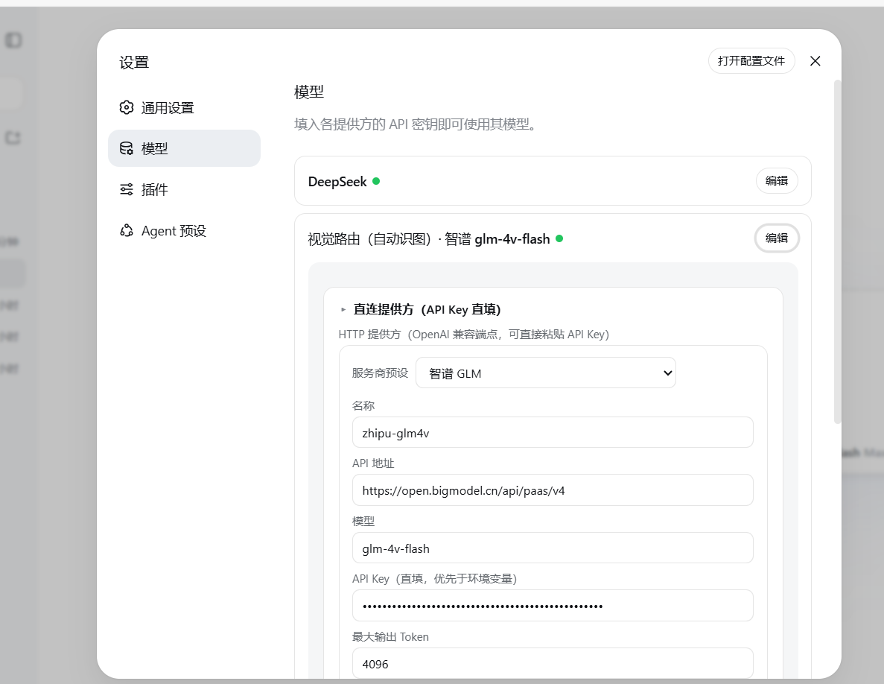

# DeepSeek Harness 插件合集（by 亿哲学长）

> 🔒 **隐私声明：本仓库不含任何 API Key。** 视觉后端 Key 一律通过界面「API Key 直填」粘贴配置（v1.3.0+），只保存在本机 `data/settings.yaml`，不会写入插件、不会随仓库分发、不记录日志。上传前请再次确认没有把密钥写进任何文件。

本仓库包含两个可在 DeepSeek Harness（dsh）上使用的插件：

## 📁 插件列表

| 插件 | 作用 | 作者归属 |
| --- | --- | --- |
| `dsh-project-file-explorer` | 项目文件浏览器：屏幕右缘文件树 + 主区预览标签（代码/图片/PDF） | **亿哲学长（BillionSeniors）原创** |
| `dsh-vision-router` | **图片识别**：粘贴图片自动识图（描述 / OCR / 定位 / 裁剪 / 取色等） | **原作者 ysr666 原创（MIT 协议），亿哲学长再发布 / 定制** |

## 🖼️ 图片识别是哪个？用谁的 AI？

- **识别功能是谁的**：图片识别由 `dsh-vision-router` 提供 —— 这是原作者 **[ysr666](https://github.com/ysr666)** 的原创作品（[原仓库](https://github.com/ysr666/dsh-vision-router)，MIT 协议）。包括 `vision_describe` / `vision_ocr` / `vision_ground` / `vision_crop` 等全套像素级视觉工具与图片轮自动路由。
- **看图用哪个 AI**：插件把图片交给**你配置的视觉模型**识别（任意 OpenAI 兼容视觉端点）：
  - **默认：内置免费链（OVH）** —— 不配任何 Key 也能直接看图（`vision-http` 免费端点，Qwen3.5-397B-A17B，失败自动回退 Qwen2.5-VL-72B-Instruct）
  - 配置后：**智谱 GLM-4V-Flash**（免费额度）、**豆包**（火山方舟）、**通义**（阿里云百炼）、**SiliconFlow**、**OpenRouter**、**Gemini**（Google）、**OpenAI** 等 —— 配了谁就用谁
- **怎么切换**（v1.3.x）：
  1. 打开 **设置 → 模型**，点「视觉路由（自动识图）」行的**编辑**（企业级编辑器）
  2. 顶部「HTTP 提供方（API Key 直填）」：选服务商预设（智谱 / 豆包 / 通义 / SiliconFlow / OpenRouter / OpenAI / Claude 等）或手动填 baseURL + 模型名，**直接粘贴 API Key 点保存**即可；直填 Key 优先于环境变量
  3. 插件设置卡片（设置 → 插件 → 视觉路由）只负责显示**当前识图 AI** + 更新 + 测试连接，编辑统一在模型页
- **界面怎么显示当前用的谁**：改完保存即生效 —— 聊天页模型选择器显示 `DeepSeek + 自动识图（智谱 glm-4v-flash）`；设置页路由行显示 `视觉路由（自动识图）· 智谱 glm-4v-flash`；未配置任何 Key 时显示「内置免费链（OVH）」
- **亿哲学长改了什么**：见 [`dsh-vision-router/README.md`](dsh-vision-router/README.md) —— 在界面显示当前识图 AI 的名称、修正设置页注册时机、**v1.3.0 新增「API Key 直填」**（模型页直接粘贴 Key 保存，无需环境变量 / YAML）、**v1.3.3 补丁自动应用**（安装后无需手动命令）；**未改动原作者任何识图逻辑**，MIT 许可与原版权声明完整保留。

实际使用效果：聊天里发图，模型自动调用 `vision_describe` 等像素级视觉工具识别图片内容：



## 🚀 安装

DeepSeek Harness（dsh）界面总览：



```bash
# ① 文件浏览器（亿哲学长原创）
dsh plugin add github:BillionSeniors/dsh-plugins/dsh-project-file-explorer

# ② 图片识别（ysr666 原创，亿哲学长定制版）
dsh plugin add github:BillionSeniors/dsh-plugins/dsh-vision-router
```

装完后重启 `dsh web`，屏幕右缘出现**项目文件树**（文件浏览器插件）：



粘贴图片 → 聊天模型选择器选带「+ 自动识图」的组（如 `DeepSeek + 自动识图`）→ 发送即可：



> 🧩 **模型页企业级编辑器（核心补丁，v1.3.3+ 全自动）**：vision-router 把「设置 → 模型 → 视觉路由 → 编辑」升级为分组卡片式企业界面（顶部「HTTP 提供方（API Key 直填）」+ 服务商预设 + 其余配置折叠收纳）。**插件加载时自动检测并应用补丁**——`dsh plugin add` 安装后重启 DSH（或刷新页面）即可，无需任何手动命令。
>
> 自动应用只对发布基线一致（0.1.0-rc.6）的核心打补丁，打前自动备份原文件（`client.js.orig-bak`），版本不匹配自动跳过、绝不破坏安装；DSH 升级覆盖核心后，下次加载自动重新打上。手动命令仍可用：`node scripts/patch-harness.mjs`（应用）/ `--check`（查看状态）。

实际效果（设置 → 模型 → 视觉路由（自动识图）→ 编辑）：



## 🔑 视觉后端 Key 配置（只在本机，不入库）

v1.3.0 起支持**界面直填 Key**，无需再设置环境变量：

1. 打开 **设置 → 模型**，点「视觉路由（自动识图）」行的**编辑**（企业级编辑器）；
2. 在顶部「HTTP 提供方（API Key 直填）」里选择服务商预设（智谱 / 豆包 / 通义 / SiliconFlow / OpenRouter / OpenAI / Claude 等），或手动填 baseURL + 模型名；
3. 在 **API Key** 输入框粘贴你的 Key，点**保存**；
4. 行上的**状态圆点**变为「已配置」，识图即可使用；未配置时显示「未配置」，并自动回退内置免费 OVH 链。

> ⚠️ Key 只保存在你本机的设置文件中；切勿把 Key 值写进本仓库的任何文件。

## 📄 目录结构

```
├── README.md                        # 本文件（总览 + 归属 + 隐私声明）
├── assets/                          # 界面截图（README 配图）
├── dsh-project-file-explorer/       # 亿哲学长原创：项目文件浏览器
│   ├── lib/                         #   host 端 + 浏览器端
│   ├── scripts/                     #   一键安装 / 补丁脚本
│   ├── example/                     #   cordis.patch.yml 示例
│   └── ...
└── dsh-vision-router/               # ysr666 原创（MIT）+ 亿哲学长定制：图片识别
    ├── index.js                     #   host 端（含"显示当前识图 AI"增强）
    ├── lib/                         #   浏览器端 + 工具
    ├── LICENSE                      #   MIT（原作者版权，不可移除）
    └── ...
```

## ⚖️ 许可

- `dsh-project-file-explorer`：MIT（亿哲学长）
- `dsh-vision-router`：MIT（**原作者 ysr666**，版权声明见其 LICENSE，再发布 / 定制时保留）

